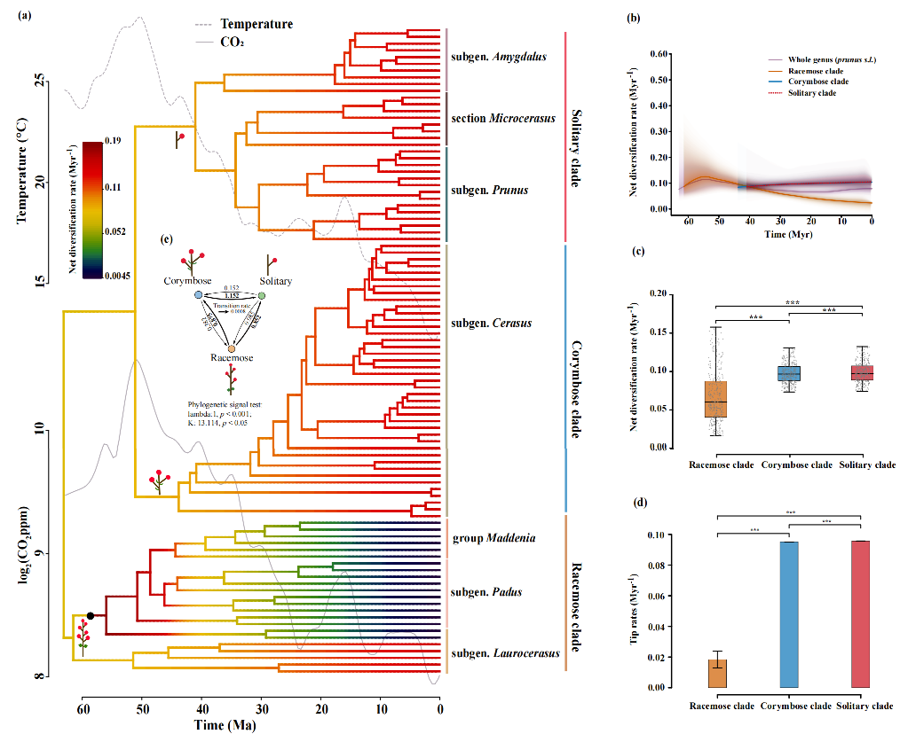

#  Phylogenomics of _Prunus_

This repository contains all scripts used in the phylogenomic study of *Prunus* (Rosaceae). The pipeline covers raw data download, sequence assembly, gene/species tree inference, divergence time estimation, diversification analyses, and trait evolution.

If you use any data and script in our study, please cite:

**Xueqin Wang**, Xin Liu, Zijia Lu, Tao Xiong, Liguo Zhang, Wyckliffe Omondi Omollo, Xinru Zhang, Mengmeng Wang, Jie Zhang, Zhun Xu, Guangwan Hu, Binbin Liu, Richard G. J. Hodel, Jun Wen, Zhiduan Chen, Miao Sun. (2026). Nuclear Phylogenomics Sheds Light on Traits- and Environment-Driven Diversification, in _Prunus_ s.l. (Rosaceae).

**Note:**  
	"*All absolute file paths in the scripts have been replaced with `/path/to/...` placeholders — update them to match your local file system before running.*"

## Software Requirements

### Command-line tools

| Software | Use |
|----------|-----|
| HybPiper ≥ 2.0 | Target enrichment assembly; paralog retrieval |
| IQ-TREE 2 ≥ 2.2 | Gene tree inference |
| ASTRAL 5.7.8 | Coalescent species tree (unweighted) |
| ASTRAL-Pro3 | Coalescent species tree (multi-copy) |
| TreeShrink ≥ 1.3 | Long-branch filtering |
| MAD | Minimum ancestor deviation rerooting |
| OrthoFinder ≥ 2.5 | Ortholog identification |
| PaRaGone | Paralog pruning (MO / MI / 1-to-1) |
| MCMCtree (PAML) | Bayesian divergence time estimation |
| SortaDate | Clock-gene selection |
| BAMM ≥ 2.5 | Diversification rate shifts |
| CLaDS2 (Julia) | Cladogenetic diversification shifts |
| TreeCmp 2.0-b76 | Tree topology distance comparison |
| Trimmomatic 0.38 | Read quality trimming |
| FastQC / MultiQC | Quality control |
| seqtk | Format conversion |
| AMAS | Alignment concatenation |
| nw_reroot / nw_ed (Newick Utilities) | Tree manipulation |

### R packages

| Package | Use |
|---------|-----|
| ape | Tree I/O, manipulation, ACE |
| phytools | cophylo, make.simmap, phylosig |
| geiger | Model fitting, name.check |
| BAMMtools | BAMM post-processing |
| MCMCtreeR | Dated tree visualisation |
| RPANDA | Paleoenvironment diversification models |
| hisse | MiSSE hidden-state diversification |
| diversitree | MuSSE / FiSSE |
| caper | D statistic (phylo.d) |
| ggplot2 / ggraph / igraph | Visualisation, Q-network plots |
| pspline | Spline fitting for paleotemperature / CO₂ |
| viridis / RColorBrewer / scales | Color palettes |
| qpcR | Akaike weights |

---

---

## Table of Contents

- [1. Data Download](#1-data-download)
- [2. Angiosperms353 Pipeline](#2-angiosperms353-pipeline)
- [3. Orthofinder Pipeline](#3-orthofinder-pipeline)
- [4. Clock Gene Selection (SortaDate)](#4-clock-gene-selection-sortadate)
- [5. Divergence Time Estimation (MCMCtree)](#5-divergence-time-estimation-mcmctree)
- [6. Diversification Rate Analyses](#6-diversification-rate-analyses)
  - [6.1 BAMM](#61-bamm)
  - [6.2 CLaDS](#62-clads)
  - [6.3 DR Statistic](#63-dr-statistic)
  - [6.4 RPANDA](#64-rpanda)
- [7. Trait-Dependent Diversification](#7-trait-dependent-diversification)
  - [7.1 FiSSE](#71-fisse)
  - [7.2 MiSSE](#72-misse)
  - [7.3 MuSSE](#73-musse)
  - [7.4 HiSSE](#74-hisse)
  - [7.5 State Transition Counts](#75-state-transition-counts)
- [8. Phylogenetic Signal](#8-phylogenetic-signal)
- [9. Tree Comparison (TreeCmp)](#9-tree-comparison-treecmp)
- [10. Cophylogenetic Analysis](#10-cophylogenetic-analysis)
- [Software Requirements](#software-requirements)

---

## 1. Data Download

**Directory:** `Download_data/`

| Script | Description |
|--------|-------------|
| [Download_data.sh](Download_data/Download_data.sh) | Download raw sequencing data from NCBI SRA using `prefetch`; rename files from SRR accessions to species names; convert `.sra` → `.fastq` with `fastq-dump`; convert `.fasta` → `.fastq` with `seqtk`; quality trim with Trimmomatic (paired-end and single-end); run FastQC / MultiQC quality control |

---

## 2. Angiosperms353 Pipeline

**Directory:** `Angiosperms353/`

Target enrichment sequencing analysis using the Angiosperms353 universal bait set. Outgroup: *Lyonothamnus floribundus*.

| Script | Description |
|--------|-------------|
| [step1_hybpiper.sh](Angiosperms353/step1_hybpiper.sh) | Assemble target loci from trimmed reads using HybPiper (`hybpiper assemble`) |
| [step2_make_gene_tree.sh](Angiosperms353/step2_make_gene_tree.sh) | Extract assembled sequences per locus and prepare multiple sequence alignments |
| [step3_iqtree2.sh](Angiosperms353/step3_iqtree2.sh) | Infer per-gene maximum likelihood trees with IQ-TREE 2 |
| [step4_reroot.sh](Angiosperms353/step4_reroot.sh) | Reroot gene trees using *Lyonothamnus floribundus* as outgroup (`nw_reroot`) |
| [step5_reroot.R](Angiosperms353/step5_reroot.R) | MAD (Minimum Ancestor Deviation) rerooting for gene trees that lack the outgroup tip |
| [step6_astral.sh](Angiosperms353/step6_astral.sh) | Collapse low-support nodes (BS ≤ 10); infer coalescent species tree with ASTRAL-Pro3 and ASTRAL; reroot the resulting species tree |
| [step7_treeshrink.sh](Angiosperms353/step7_treeshrink.sh) | Filter outlier long branches across gene trees using TreeShrink; summarise filtering results per gene |

**Main output:** `Prunus_353_Astral_BS10.tre`

---

## 3. Orthofinder Pipeline

**Directory:** `Orthofinder/`

Single-copy ortholog identification from genome/transcriptome data, followed by gene tree inference and coalescent species tree reconstruction.

| Script | Description |
|--------|-------------|
| [step1_OrthoFinder.sh](Orthofinder/step1_OrthoFinder.sh) | Run OrthoFinder on protein sequences to identify orthogroups |
| [step2_hybpiper.sh](Orthofinder/step2_hybpiper.sh) | Run HybPiper `paralog_retriever` to extract all paralogous copies per locus |
| [step3_paragone.sh](Orthofinder/step3_paragone.sh) | Prune paralogs using PaRaGone under three strategies: MO (Monophyletic Outgroups, ~5477 genes), MI (Maximum Inclusion, ~8316 genes), 1-to-1 (strict single-copy, ~3736 genes) |
| [step4_iqtree2.sh](Orthofinder/step4_iqtree2.sh) | Infer per-gene ML trees with IQ-TREE 2 for all three paralog-pruning datasets |
| [step5_reroot.sh](Orthofinder/step5_reroot.sh) | Reroot gene trees using *Lyonothamnus floribundus* as outgroup |
| [step6_reroot.R](Orthofinder/step6_reroot.R) | MAD rerooting for gene trees that lack the outgroup tip |
| [step7_astral.sh](Orthofinder/step7_astral.sh) | Collapse low-support nodes (BS ≤ 10); infer coalescent species trees with ASTRAL-Pro3 and ASTRAL |
| [step8_treeshrink.sh](Orthofinder/step8_treeshrink.sh) | Filter outlier long branches with TreeShrink; summarise filtering results |

**Main outputs:**
- `Prunus_Astral_BS10_treeshrink_MO.tre`
- `Prunus_Astral_BS10_treeshrink_MI.tre`
- `Prunus_Astral_BS10_treeshrink_1to1.tre`

---

## 4. Clock Gene Selection (SortaDate)

**Directory:** `Orthofinder/Sortadate/`

| Script | Description |
|--------|-------------|
| [step1_Sortadate.sh](Orthofinder/Sortadate/step1_Sortadate.sh) | Calculate SortaDate statistics (root-to-tip variance, tree length, bipartition support) for all gene trees to rank genes by clock-likeness |
| [step2_run_pipeline_ortholog.sh](Orthofinder/Sortadate/step2_run_pipeline_ortholog.sh) | Filter and select the top-ranked clock genes; concatenate selected alignments with AMAS; copy the final supermatrix to the MCMCtree working directory |

---

## 5. Divergence Time Estimation (MCMCtree)

**Directory:** `Orthofinder/Sortadate/mcmctree/`

| Script | Description |
|--------|-------------|
| [step1_mcmctree.sh](Orthofinder/Sortadate/mcmctree/step1_mcmctree.sh) | Prepare the supermatrix alignment; run MCMCtree (PAML) under the approximate likelihood method with fossil calibration constraints |
| [step2_mcmctree.R](Orthofinder/Sortadate/mcmctree/step2_mcmctree.R) | Visualise the dated phylogeny with geological timescale using the MCMCtreeR package |

**Central output used by all downstream analyses:** `Prunus.mcmctree.dated_no_outgroup.tre`

---

## 6. Diversification Rate Analyses

### 6.1 BAMM

**Directory:** `Orthofinder/Sortadate/mcmctree/BAMM/`

Bayesian Analysis of Macroevolutionary Mixtures — detects shifts in diversification rates across the phylogeny.

| Script | Description |
|--------|-------------|
| [step1_NEXUS_100.R](Orthofinder/Sortadate/mcmctree/BAMM/step1_NEXUS_100.R) | Convert the dated tree to NEXUS format and multiply all branch lengths by 100 as required by BAMM |
| [step2.sh](Orthofinder/Sortadate/mcmctree/BAMM/step2.sh) | Calculate BAMM prior parameters with `setBAMMpriors` (BAMMtools) and prepare the BAMM control file |
| [step3_BAMM.sh](Orthofinder/Sortadate/mcmctree/BAMM/step3_BAMM.sh) | Run BAMM on the dated phylogeny |
| [step4_BAMMtools.R](Orthofinder/Sortadate/mcmctree/BAMM/step4_BAMMtools.R) | Set and inspect BAMM prior distributions using BAMMtools |
| [step5_BAMM_2025.10.18.R](Orthofinder/Sortadate/mcmctree/BAMM/step5_BAMM_2025.10.18.R) | Full BAMM post-processing: MCMC convergence diagnostics, credible shift sets, rate-through-time curves, phylorate plots, mean speciation/extinction rate extraction, and pairwise clade comparisons |

### 6.2 CLaDS

**Directory:** `Orthofinder/Sortadate/mcmctree/Clads/`

Cladogenetic Diversification rate Shifts — infers per-branch speciation rates allowing gradual rate changes.

| Script | Description |
|--------|-------------|
| [step1_clads.sh](Orthofinder/Sortadate/mcmctree/Clads/step1_clads.sh) | Run CLaDS2 inference in Julia on the dated tree; save posterior tip-rate output |
| [step2_clads.R](Orthofinder/Sortadate/mcmctree/Clads/step2_clads.R) | Load CLaDS output, extract MAP tip diversification rates, and export per-species rate table |

### 6.3 DR Statistic

**Directory:** `Orthofinder/Sortadate/mcmctree/DR/`

Inverse equal-splits (DR) metric — a fast tip-level diversification rate estimator (Jetz et al. 2012).

| Script | Description |
|--------|-------------|
| [step1_DR.sh](Orthofinder/Sortadate/mcmctree/DR/step1_DR.sh) | Calculate the DR statistic for all tips using the dated tree |
| [step2_DR_statistic.R](Orthofinder/Sortadate/mcmctree/DR/step2_DR_statistic.R) | Compute DR values in R and export per-species rate table as CSV |

### 6.4 RPANDA

**Directory:** `Orthofinder/Sortadate/mcmctree/RPANDA/`

Fit paleoenvironment-dependent birth–death models to the dated phylogeny.

| Script | Description |
|--------|-------------|
| [step1_rPANDA_all_model.R](Orthofinder/Sortadate/mcmctree/RPANDA/step1_rPANDA_all_model.R) | Fit 19 birth–death models: constant (BCST, BCSTDCST), CO₂-dependent (exponential + linear, 6 models), temperature-dependent (exponential + linear, 6 models), time-dependent (exponential + linear, 6 models); compute AICc and Akaike weights; save all results |
| [step2_RPANDA_plot.R](Orthofinder/Sortadate/mcmctree/RPANDA/step2_RPANDA_plot.R) | Plot speciation, extinction, and net diversification rate curves for the three best models (BTimeVarDTimeVar_LIN, BTempVarDTempVar_LIN, BCO2VarDCST_EXPO) against a geological timescale background |

**Environmental covariates:**
- `data/temperature-0.5ma-FABIEN-approx-63.csv` — Cenozoic paleotemperature
- `data/500kyrCO2_combined_62.75Ma.txt` — Atmospheric CO₂ concentration

---

## 7. Trait-Dependent Diversification

### 7.1 FiSSE

**Directory:** `Orthofinder/Sortadate/mcmctree/FiSSE/`

| Script | Description |
|--------|-------------|
| [Fisse.R](Orthofinder/Sortadate/mcmctree/FiSSE/Fisse.R) | Run the Fast Binary SSE (FiSSE) permutation test for three binary traits — ploidy, lifeform (woody vs. herbaceous), and perianth presence — to test whether trait state is associated with diversification rate differences |

### 7.2 MiSSE

**Directory:** `Orthofinder/Sortadate/mcmctree/MiSSE/`

| Script | Description |
|--------|-------------|
| [MiSSE.R](Orthofinder/Sortadate/mcmctree/MiSSE/MiSSE.R) | Fit MiSSE (trait-free hidden-state SSE) models with 1–5 hidden states; select the best model by AICc; reconstruct marginal net diversification rates on the phylogeny with `MarginReconMiSSE`; plot rate-mapped phylogeny (taxon sampling fraction: 83/352 ≈ 23.6%) |

### 7.3 MuSSE

**Directory:** `Orthofinder/Sortadate/mcmctree/MuSSE/`

| Script | Description |
|--------|-------------|
| [Musse_inflorescence_types_Musse.R](Orthofinder/Sortadate/mcmctree/MuSSE/Musse_inflorescence_types_Musse.R) | Run MuSSE (Multi-State SSE) for inflorescence type (3 states: 0 = solitary, 1 = corymbose, 2 = racemose); compare null / free-λ / free-μ / full models by AIC; run Bayesian MCMC for the best model (free-λ); plot posterior speciation and net diversification rate densities per state |

### 7.4 HiSSE

**Directory:** `Orthofinder/Sortadate/mcmctree/HiSSE/`

| Script | Description |
|--------|-------------|
| [hisse.R](Orthofinder/Sortadate/mcmctree/HiSSE/hisse.R) | Automated HiSSE pipeline for all binary traits in a `traits/` folder: fit 4 models per trait (BiSSE full, BiSSE null, HiSSE full, HiSSE CID-2 null); save per-model RData; compute AICc and AIC weights; export per-CSV and combined summary CSV |

### 7.5 State Transition Counts

**Directory:** `Orthofinder/Sortadate/mcmctree/`

| Script | Description |
|--------|-------------|
| [Four_state_transition_times.R](Orthofinder/Sortadate/mcmctree/Four_state_transition_times.R) | Stochastic character mapping (1000 simulations, `make.simmap`) to estimate transition counts and time spent in each state for four traits: inflorescence type (ER model), petal presence/absence (ER), ploidy (ER), and lifeform — evergreen vs. deciduous (ARD) |

---

## 8. Phylogenetic Signal

**Directory:** `Orthofinder/Sortadate/mcmctree/phylo_signal/`

| Script | Description |
|--------|-------------|
| [phylo_signal_results_auto_full.R](Orthofinder/Sortadate/mcmctree/phylo_signal/phylo_signal_results_auto_full.R) | Automated pipeline applied to all trait CSV files: automatic best-model selection (ER / SYM / ARD) by AICc; ancestral state reconstruction (ACE) plots with node pie charts; stochastic character mapping and transition-rate Q-network visualisation (ggraph); D statistic for binary traits (Fritz & Purvis); Pagel's λ and Blomberg's K; summary table exported to CSV |

---

## 9. Tree Comparison (TreeCmp)

**Directory:** `Ortholog_vs_353_treecmp/`

| Script | Description |
|--------|-------------|
| [TreeCmp.sh](Ortholog_vs_353_treecmp/TreeCmp.sh) | Compute pairwise topological distances (matching-split MS distance and Robinson–Foulds RF distance, window size 5) among the four species trees (Angiosperms353, MO, MI, 1-to-1) using TreeCmp v2.0 |

---

## 10. Cophylogenetic Analysis

**Directory:** `cophylo/`

| Script | Description |
|--------|-------------|
| [ortholog_Angiosperms353.R](cophylo/ortholog_Angiosperms353.R) | Side-by-side cophylogenetic plot comparing the Angiosperms353 species tree against each of the three Orthofinder species trees (MO, MI, 1-to-1) using `cophylo` (phytools); node labels and curved links overlaid |
| [ortholog_MI_MO_1to1.R](cophylo/ortholog_MI_MO_1to1.R) | Pairwise cophylogenetic plots among the three Orthofinder trees (MO vs. MI, MO vs. 1-to-1, 1-to-1 vs. MI) to assess topological congruence across paralog-pruning strategies |

---

